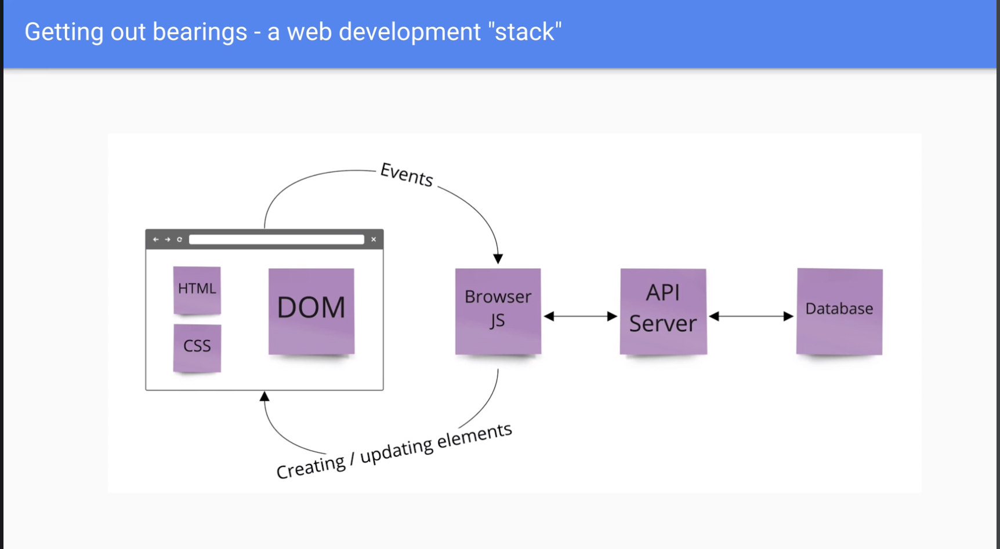

# REACT DOCUMENT

#### This is a document for REACT fundamentals - save it for future reference

---

## What is REACT? 

- REACT is a JavaScript library for building user interfaces

- Let's review at what we learn: 

