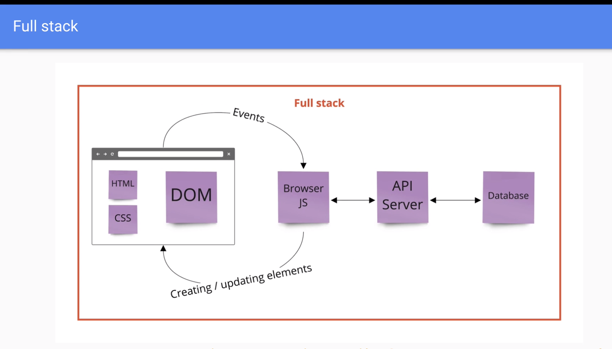

# REACT DOCUMENT

#### This is a document for REACT fundamentals - save it for future reference

---

## What is REACT? 

– REACT is a JavaScript library for building user interfaces

– Let's review at what we learn: 

 
 - DOM: how JS interacts with HTML with events and other elements

 - API server: save data ( when you reload page, data will still be there) a communication between web applications

 - HTML, CSS, DOM , JS: Client-side. UI interface

- API server, Database: Server-side. Data base

