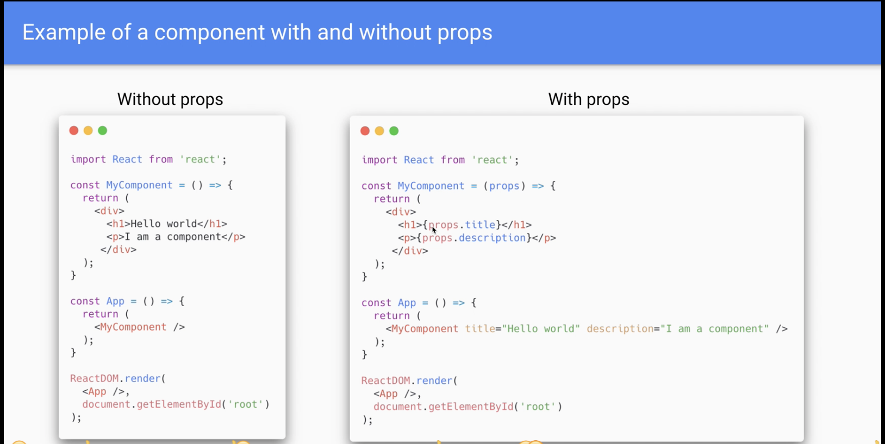

# REACT properties and children

- Parts of React appilcation

```
// Load the react library into this file
import './App.css';

// a custom React component
function App() {
  return (
    
    <div className="App intro">
      <h1>Hello world</h1>
      <p>I am a component</p>
    </div>
  );
}

// main React component, wraps all other components
const MyComponent = () => {
    return (
        <My component />
    );
}

// Render the main React Component into the DOM
ReactDom.render(
    <App />,
    document. getElementById('root')
);

```
---

## Props

- Stands for property: enable us to reuse same code in a different functions

