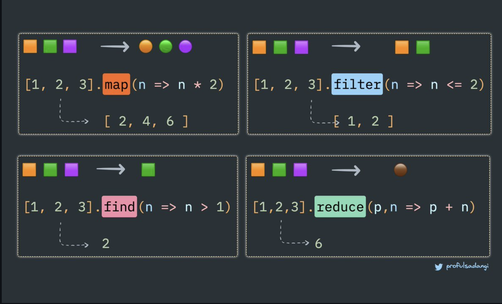
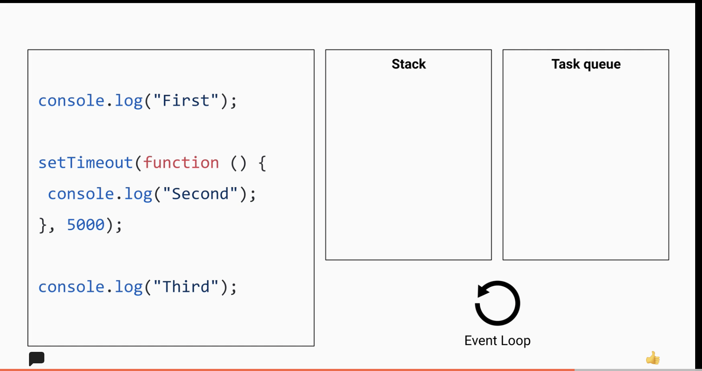
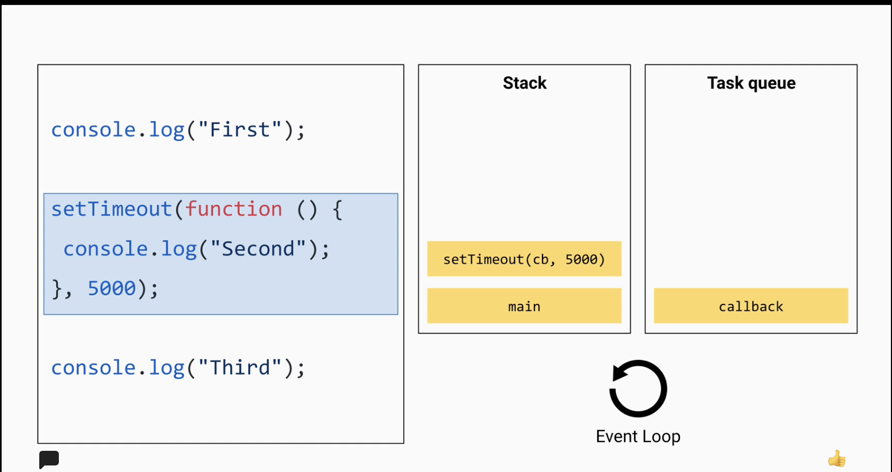
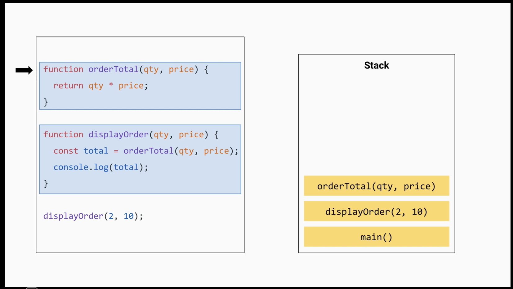

# React component 

- A piece block of code which is reusable bits of code

# REACT properties and children

- Parts of React appilcation

```
// Load the react library into this file
import './App.css';

// a custom React component
function App() {
  return (
    
    <div className="App intro">
      <h1>Hello world</h1>
      <p>I am a component</p>
    </div>
  );
}

// main React component, wraps all other components
const MyComponent = () => {
    return (
        <My component />
    );
}

// Render the main React Component into the DOM
ReactDom.render(
    <App />,
    document. getElementById('root')
);

```
---

## Props

- Stands for property: enable us to reuse same code in a different functions


- Attribute's name will automatically pass into function App

### Components using props

- {props}


### Destructuring props

- we can omit props. and keep the attribute. ie: {props.type} -> {type}

## Children

- You can nest normal HTML elements inside a custom components
- We can reuse components

```
const Post = ({ title, children }) => {
  return (
    <div>
      <h1>{title}</h1>
      {children} {/*children inside Post component */}
    </div>
  ); 
};

function App() {
  return (
      <Post title="My blog post 1" text="blah blah blah">
        <p>This is Amazing</p>
        <p>Im putting a children inside a custom components</p>
      </Post>
  );
}

```

---


# JavaScript Modules

– Isolated pieces of code, in one file

– They expose an interface so other modules can interact with them

– They can be re-used

– They can be shared

– Imagine JavaScript components like a watch


```
// imports

import anotherModule from 'anotherModule' ;

const myModule = () => {
  anotherModule('Calling someone elses module');
}

// exports

export default myModule;

```

--- 

## Callbacks function

– Is a function that calls by another function

– Imagine it's like an answering machine


```
const phoneMark = (callback) => {
  //Mark maybe is unavailable for now (false), but will be available within 30 minutes
  const returningCall = true;
  if(returningCall) {
    callback();
  }
};

const phoneMe = () => {
  const myNumber = "022 3456 32432";
  makePhoneCall(myNumber);
}

phoneMark(phoneMe); //when Mark is available, call phoneMe function. Callback function is used when Mark is ready
```

### Why use callbacks?

– We want a function to be in control of when another function is called
– " Run my function, when you have finished doing your thing "


## Event Handler 

### How Event Handler works on DOM?
```
const btnEl = document.querySelector("#myBtn");
const log = () => {
  console.log("clicked);
}

btnEl.addEventListener('clicked', log)
```

### How Event Handler works on React?

```
const MyComponent = () => {
  const onClick = () => {
    alert("Clicked!")
  };

  return(
    <button onClick = {onClick}>Buy Me</button>
  ) //when someone clickes button, we run button
}
```

## Array Method

### Filter

- filter an array. Filter method takes a callback function.Filter creates a new array and does not change the original array

```
filteredProducts = products.filter(
  (product) => product.category === "sunglasses"
)
```

### Map
– map will give you a new array and doesn't update the old array

– loop through each item one by one and create a new array. new array has the same amount of items like original array. 

```
const newProducts = products.map((product) => ({
   name: product.name,
   price: formatAmount(product.price),
   categoryL product.category
 }));
```

- To return an Object without return word, we have to wrap {} inside () => ({ }) to avoid confuse JS 

**CHEAT SHEET**



## Promises

- Async vs sync: 

+ Async: when future is unpredictable

- fetch is a function that returns a promise

- The code below is called a promise. It promises to give you the downloaded episode of games of thrones, but please wait when it does it
```
await fetch("https://badtorrent.com/game-of-thrones.mp4") //await: wait for it finished

```

```
const fetchGot = async() => {
  //whatever happens inside this function is unpredictable, doesn't know how long it takes, so please wait and eventually it will be done

  const episode = await fetch("https://badtorrent.com/game-of-thrones.mp4") 

}
```

- There's another way similar to Promise, which is Then syntax

```
const fetchGot = () => {
  fetch("http://badtorrent.com/got.mpf").then((episode) => {
    console.log(episode);
  })
}
```

### Asynchronous JavaScript: 
- when your program allows you to do multiple tasks while taking the previous task and processing it for you. until the task has finished, it will run it later

```
console.log("First");
setTimeOut(function () {
  console.log("Second");
})
console.log("Third");

```
- How async works? It works through the event loop. 




- it will pop the piece of code to Stack. and then execute first console.log. After finishing it, it will move onto setTimeOut. But because setTimeOut function will happen in the future so async will move it into queue



- JS will remove setTimeOut function out of Stack and execute the third console log. and after 5s, it will come back to call back function and pop it back to stack, execute it and remove it 

### Synchronous JavaScript

- only execute one task at a time

- imagine we execute this block of code in browser. this block will all goes inside Stack. JS will read from top to bottom and then it comes to function call, it will pop the function to Stack




- Let's look at this piece of code:
```
function orderTotal(qty, price) {
  return qty * price;
}
function displayOrder(qty, price) {
  const total = orderTotal(qty, price);
  console.log(total);
}
displayOrder(2,10)
```

#### JS will pop this piece of code as main() on Stack. It will read from top to bottom, and then execute displayOrder(2,10) and move it on the queue. so now:

1. displayOrder(2,10)
2. main()

#### and now it will pop the values to displayOrder. and then pop orderTotal(qty, price) to the queue

1.orderTotal(qty, price)
2.displayOrder(2,10)
3.main()

– and it will execute from top to bottom orderTotal(qty, price) -> displayOrder(2,10) -> main()


