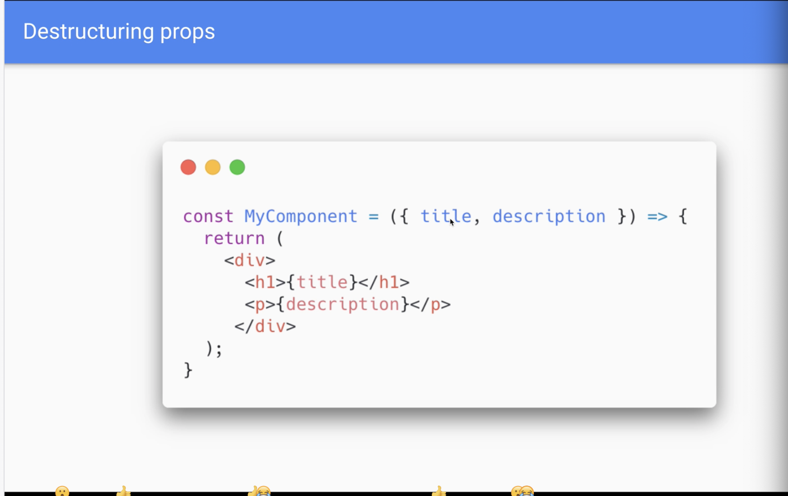
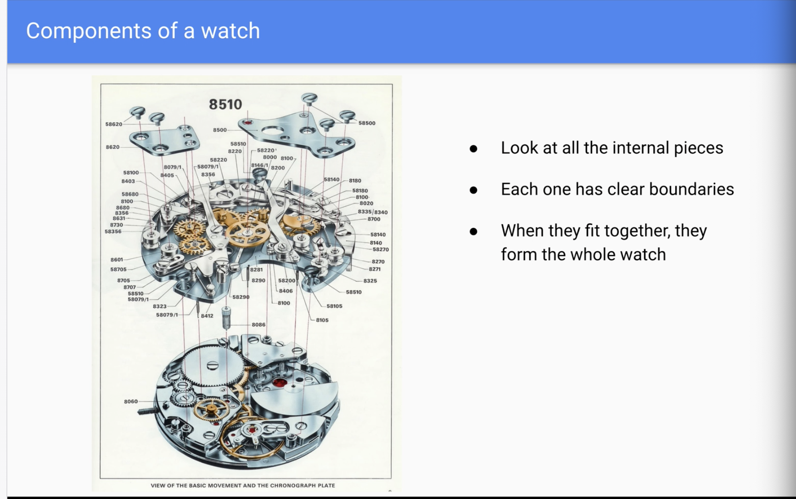
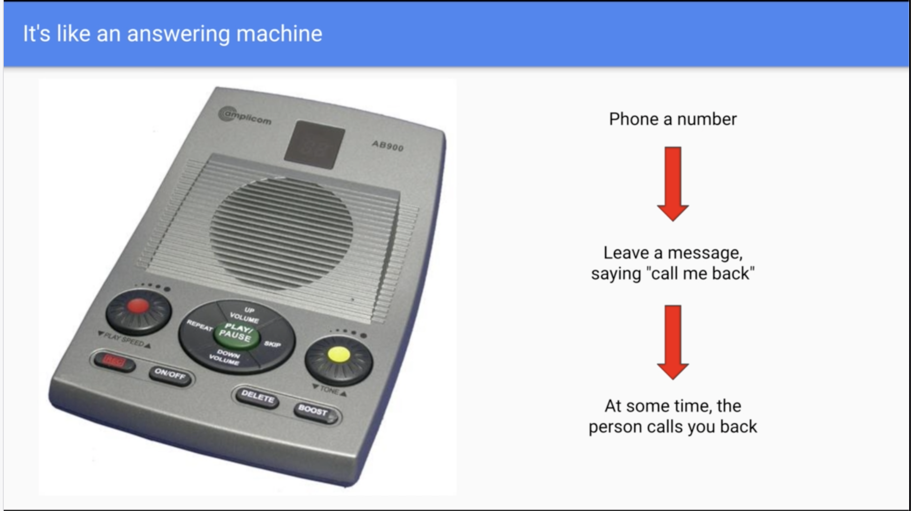

# React component 

- A piece block of code which is reusable bits of code

# REACT properties and children

- Parts of React appilcation

```
// Load the react library into this file
import './App.css';

// a custom React component
function App() {
  return (
    
    <div className="App intro">
      <h1>Hello world</h1>
      <p>I am a component</p>
    </div>
  );
}

// main React component, wraps all other components
const MyComponent = () => {
    return (
        <My component />
    );
}

// Render the main React Component into the DOM
ReactDom.render(
    <App />,
    document. getElementById('root')
);

```
---

## Props

- Stands for property: enable us to reuse same code in a different functions


- Attribute's name will automatically pass into function App

### Components using props

- {props}



### Destructuring props

- we can omit props. and keep the attribute. ie: {props.type} -> {type}

## Children

- You can nest normal HTML elements inside a custom components
- We can reuse components

```
const Post = ({ title, children }) => {
  return (
    <div>
      <h1>{title}</h1>
      {children} {/*children inside Post component */}
    </div>
  ); 
};

function App() {
  return (
      <Post title="My blog post 1" text="blah blah blah">
        <p>This is Amazing</p>
        <p>Im putting a children inside a custom components</p>
      </Post>
  );
}

```

---


# JavaScript Modules

– Isolated pieces of code, in one file

– They expose an interface so other modules can interact with them

– They can be re-used

– They can be shared

– Imagine JavaScript components like a watch



```
// imports

import anotherModule from 'anotherModule' ;

const myModule = () => {
  anotherModule('Calling someone elses module');
}

// exports

export default myModule;

```

--- 

## Callbacks function

– Is a function that calls by another function

– Imagine it's like an answering machine




```
const phoneMark = (callback) => {
  //Mark maybe is unavailable for now (false), but will be available within 30 minutes
  const returningCall = true;
  if(returningCall) {
    callback();
  }
};

const phoneMe = () => {
  const myNumber = "022 3456 32432";
  makePhoneCall(myNumber);
}

phoneMark(phoneMe); //when Mark is available, call phoneMe function. Callback function is used when Mark is ready
```

### Why use callbacks?

– We want a function to be in control of when another function is called
– " Run my function, when you have finished doing your thing "


## Event Handler 

### How Event Handler works on DOM?
```
const btnEl = document.querySelector("#myBtn");
const log = () => {
  console.log("clicked);
}

btnEl.addEventListener('clicked', log)
```

### How Event Handler works on React?

```
const MyComponent = () => {
  const onClick = () => {
    alert("Clicked!")
  };

  return(
    <button onClick = {onClick}>Buy Me</button>
  ) //when someone clickes button, we run button
}
```